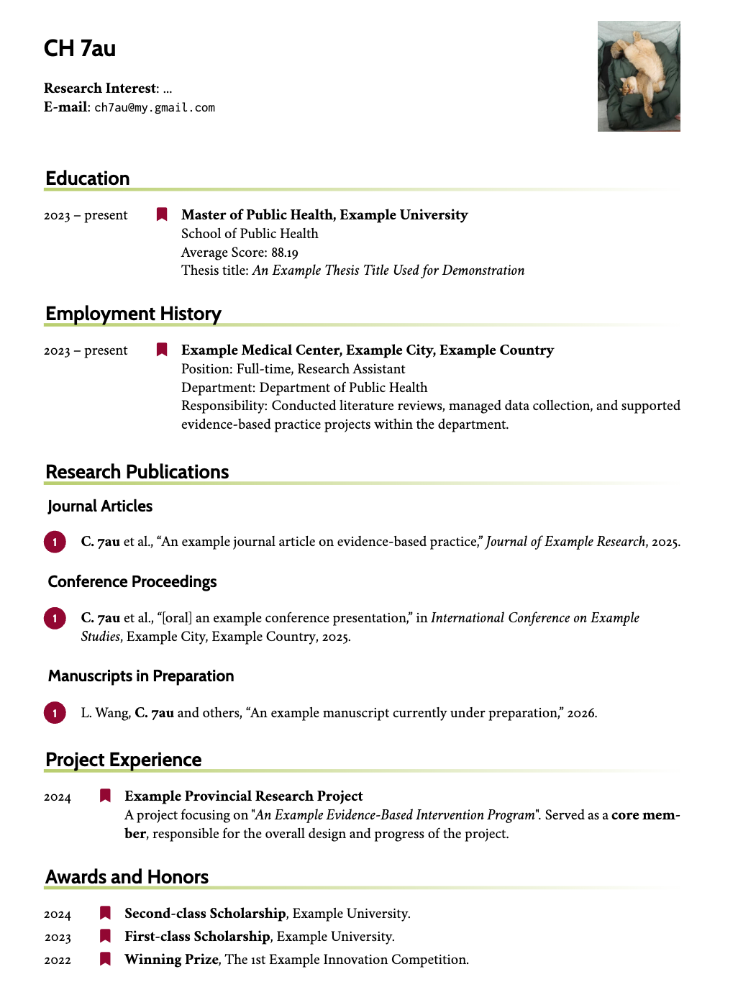

# 简历模板

一个 LaTeX 简历模板。你在几个文本文件里填上自己的信息，就能生成一份排版整齐的 PDF 简历。

**推荐用 [Overleaf](https://www.overleaf.com) 在线编译**，不用装任何软件，把项目传上去就能出 PDF。操作方法见第四节。

模板里现有的名字、邮箱、学校、论文都是**假的示例数据**，照着替换成你自己的就行。

<p align="center">
  
</p>

---

## 一、Highlights

**你只管填内容，排版不用操心。** 姓名、学校、经历、论文写进去就行，字体、颜色、行距和章节样式都由模板负责。
填多填少都不会把版面弄乱，也不需要在文字之间插排版指令。

**已发表（Articles / Proceedings）和投稿中（Manuscripts）的论文分开显示。** 两类论文各自成节，让读简历的人一眼看到你的发表记录，
同时知道哪些工作正在推进。论文状态变化后，列表会自动重新归类，不用手工搬运。

**作者再多也不会占掉半页。** 署名人多的时候，论文列表只显示到你为止，后面用省略形式收尾。
一份十几位作者的论文也只占两三行，对方能立刻看到你在其中的位置，例如：

| 你是 | 共有几位作者 | 显示成 |
|---|---|---|
| 一作 | 1 位 | `C. 7au` |
| 一作 | 3 位 | `C. 7au et al.` |
| 二作 | 2 位 | `Smith and C. 7au` |
| 二作 | 3 位 | `Smith, C. 7au and others` |
| 三作 | 3 位 | `Smith, Brown and C. 7au` |
| 三作 | 5 位 | `Smith, Brown, C. 7au and others` |

---

## 二、目录结构

```
Template/
│
├── cv-main.tex       ← 章节顺序
│
├── asset/
│   └── photo.jpg           你的证件照
│
├── sections/         ← 你要填的内容都在这里
│   ├── 01_info.tex             姓名、研究兴趣、邮箱、照片
│   ├── 02_education.tex        教育经历
│   ├── 03_employment.tex       工作经历
│   ├── 04_publications.bib     论文列表
│   ├── 05_project.tex          项目经历
│   ├── 06_honors.tex           荣誉奖项
│   └── 07_skills.tex           技能
│
└── README.md         本说明
```

**这七个文件对应简历上从上到下的七段**，序号就是它们在简历里的先后，不要改文件名。
数字前面的 `0` 不能省，`01_info.tex` 写成 `1_info.tex` 会编译失败。

其余文件是模板的运行部分，不用理会。

---

## 三、三步做出你的简历

### 第 1 步：填个人信息

打开 `sections/01_info.tex`，找到这一段，换成你自己的内容：

```latex
\leftheader{%
  % 姓名
  {\LARGE\bfseries\sffamily CH 7au} \\
  \\
  % 研究兴趣
  \textbf{Research Interest}: ...\\
  % 邮箱
  \textbf{E-mail}: \href{mailto: ch7au@my.gmail.com}{\texttt{ch7au@my.gmail.com}}
}
```

- 不需要的行直接删掉或注释掉
- 姓名下面那个单独的 `\\` 只是占位换行，用来留出一点空隙，删掉会变紧凑

**再打开「论文里加粗自己名字」的功能**，就在同一个文件往下几行：

```latex
\mynames{你的姓/你的名}
```

比如 `\mynames{Smith/John}`。只想写姓氏也可以，写成 `\mynames{Smith/}`。

**换照片**，把 `asset/photo.jpg` 换成你自己的照片，**文件名保持 `photo.jpg`，位置也不要挪**就行。

不想要照片，就在同一个文件里把这两行对调一下注释：

```latex
\includecomment{fullonly}   % ← 显示照片
% \excludecomment{fullonly} % ← 不显示照片
```

### 第 2 步：填各段经历

打开 `sections/` 文件夹，教育、工作、项目、荣誉、技能这五个文件对应简历上的五段，写法都一样：

```latex
\begin{rubric}{Education}

\entry*[2023 -- 2025]%
	\textbf{硕士, 某某大学}
    \par 某某学院，导师：某某某
    \par 平均分：88.19
%
\entry*[2019 -- 2023]%
	\textbf{学士, 某某大学}
    \par 某某学院
%
\end{rubric}
```

规律很简单：

- `\entry*[年份]` 起一条，方括号里写时间
- `\textbf{...}` 写粗体标题，比如学校名或公司名
- 下面每多一行 `\par`，就多一行说明文字

⚠️ 最容易出错的两点：

| 遇到的问题 | 原因 | 怎么办 |
|---|---|---|
| 两条经历粘成一坨 | 中间没空行 | 两条之间**空一行** |
| 两条之间空太多 | 中间多空了行 | 想分隔就用单独一行 `%`，别空行 |

### 第 3 步：填论文（没有论文可跳过）

论文写在 `sections/04_publications.bib` 里，一条一段：

```bibtex
@article{自己看得懂的编号,
  sortkey  = {1},
  title    = {论文标题},
  journal  = {期刊名},
  author   = {7au, CH and Smith, John and Brown, Alice},
  year     = {2025}
}
```

**作者按「先姓后名」写，中间用逗号**，比如本人是 `{7au, CH}`，合作者是 `{Smith, John}`。
用 `and` 把所有作者连起来，显示到哪一位、要不要加 `et al.` 由模板自动处理。

**作者列表会自动截断**，只显示到你自己为止。

规律很简单，你是第一作者就用 `et al.`，不是第一作者就用 `and others`，
已经是最后一位作者则不加后缀。

填的时候只有两个地方需要留意：

**① `sortkey` 填你是第几作者**

| 填写 | 含义 |
|---|---|
| `sortkey = {1}` | 你是第一作者 |
| `sortkey = {2}` | 你是第二作者 |

它有两个作用，一是决定同一年里哪篇排前面，你署名越靠前排得越前，二是让作者列表只显示到你自己为止。
所以这里必须填真实的署名顺序。

**② 还没发表的论文，加一行 `keywords`**

```bibtex
  keywords = {ongoing},
```

加了这行的论文会自动归到「在投」那一节。等论文正式发表，**把这行删掉**，它就会自动移回「期刊论文」里。

---

## 四、生成 PDF

用 [Overleaf](https://www.overleaf.com) 在线编译，不用装任何软件。

1. 打开 [Overleaf](https://www.overleaf.com)，注册或登录
2. 点 `New Project` → `Upload Project`
3. 把整个 `Template` 文件夹压缩成 zip，拖进去上传
4. 进项目后点左上角 `Menu`，在 `Main document` 里选 `cv-main.tex`
5. 点 `Recompile`，等几秒就有 PDF 了

之后每次改完文件，Overleaf 会自动重新编译。论文列表也会自动处理，不用你操心。

> 💡 打包前建议删掉编译产生的中间文件，比如 `cv-main.aux`、`cv-main.bbl`、`cv-main.log`。
> 它们不用上传，残留的旧 `cv-main.bbl` 还可能让论文列表不更新。

**需要写中文时**，比如中文姓名或中文期刊名，在 `Menu` → `Compiler` 里选 **XeLaTeX**，
并把 `cv-main.tex` 里 `\usepackage{ctex}` 前面那个 `%` 去掉。

---

## 致谢

本模板的排版样式来自 LianTze Lim 在 Overleaf 上发布的作品
[A Customised CurVe CV](https://www.overleaf.com/latex/templates/a-customised-curve-cv/mvmbhkwsnmwv)。
这里的中文说明和小文件拆分都在它的基础上改写，特此感谢原作者的分享。
